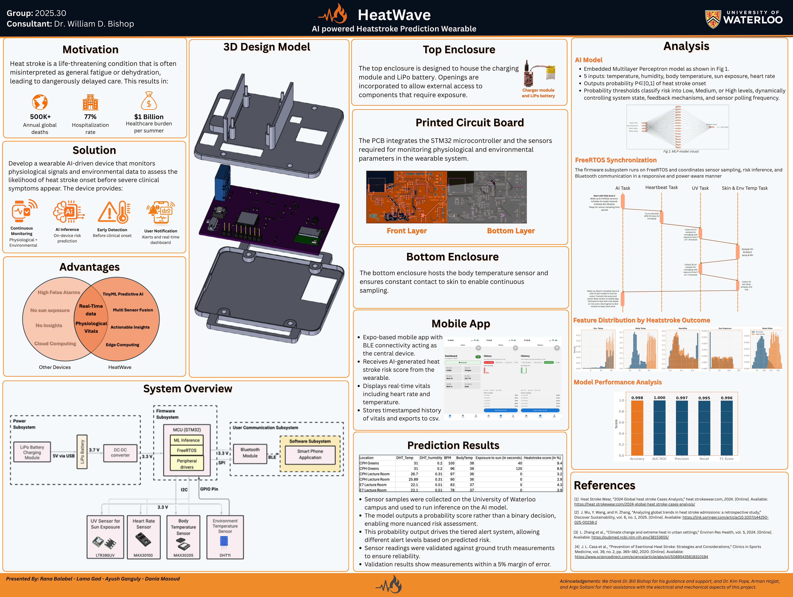

# HeatWave 🔥

**AI-Powered Heatstroke Prediction Wearable**

University of Waterloo Engineering Capstone Design Project.

HeatWave is a wearable embedded system designed to assess heatstroke
risk using physiological and environmental sensor data.

## Capstone Poster

